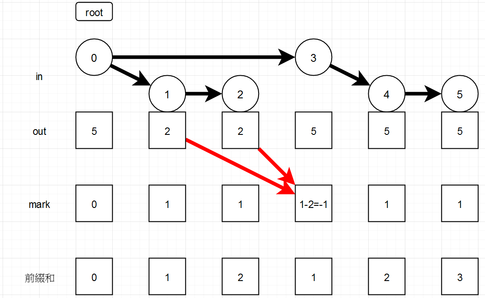

# `TIOJ 2257` 鳳梨關稅
`NHSPC 2021 PG`  
題解分析：
使用樹壓平  
`in[i]`代表節點`i`的編號  
`out[i]`代表節點`i`的子樹最大編號  
可以證明`in[i]`~`out[i]`是一個區間，該區間所有點皆為`i`的子節點  
如果我們要對`i`進行關稅調整，即`in[i]`到`out[i]`的價格可以`-1`  
再來要考慮如何維護到每個點所需要的關稅  
我們可以使用標記+前綴和  
  
我們在`in[i]`標記`+1`，`out[i]+1`標記`-1`  
因為在`out[i]+1`的時候，代表我們從某條練裡面出來了，把那些點減掉  
我們可以輕鬆算出到每個節點需要的關稅  
我們可以用`BIT`優化  

